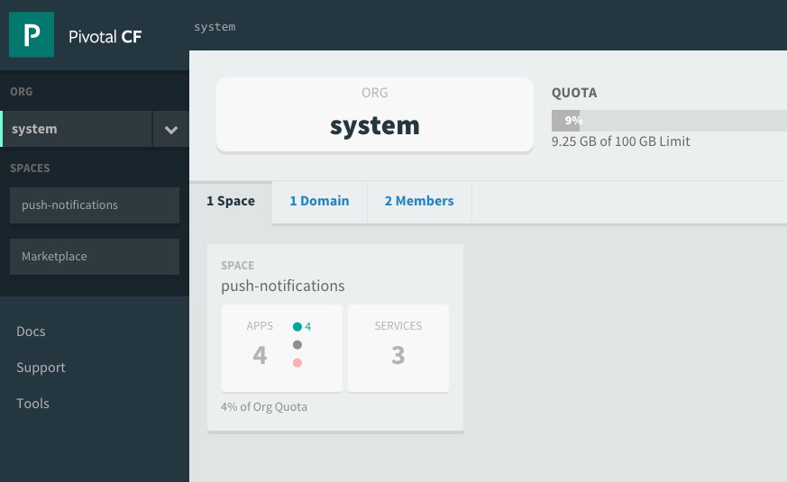
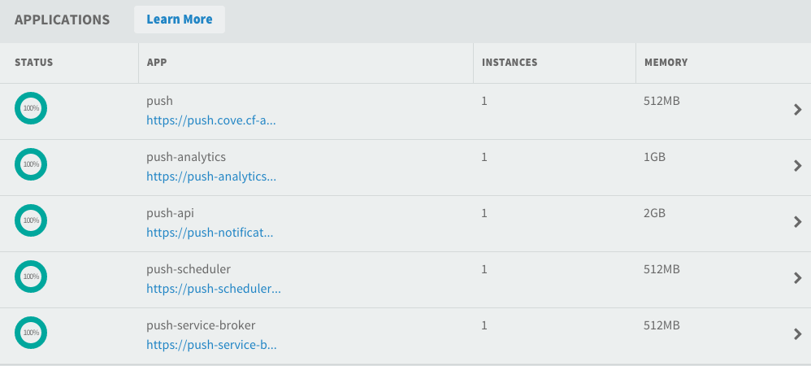
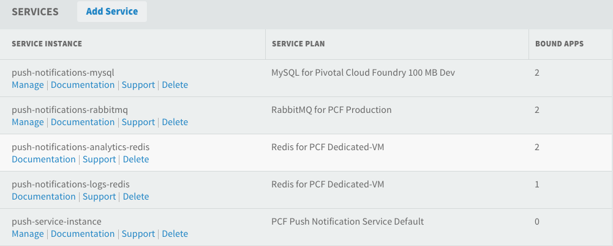

### Dependencies

The Push Notification service depends on MySQL (optionally [MySQL for Pivotal CF](https://network.pivotal.io/products/p-mysql)), [RabbitMQ for Pivotal CF](https://network.pivotal.io/products/pivotal-rabbitmq-service), and [Redis for Pivotal CF](https://network.pivotal.io/products/p-redis)  being successfully installed on [Pivotal Cloud Foundry](https://network.pivotal.io/products/pivotal-cf).

### Download the Product

Download the Push Notification software from [Pivotal Network](http://network.pivotal.io/)

### Adding the Product

To get started with Push, you need to [add the product](http://docs.pivotal.io/pivotalcf/customizing/add-delete.html) with Pivotal Ops Manager.

Before you can complete the installation you must provide some configuration.

#### Set Encryption Key

From Ops Manager click on the Pivotal Push Notification Service tile and go to the "Security Settings" section. Generate an encryption key by running the following command in terminal (you should set your own password here):

	openssl enc -aes-128-cbc -k samplepassword -P -md sha1

This will produce a salt, key, and initialization vector. Copy the key into the "Encryption Key" field on Ops Manager and click "Save". This key is used for symmetric encryption of push certificates and API keys.

#### Configure MySQL

From Ops Manager click on the Push Notification Service tile and go to the "MySQL Settings" section. Select MySQL Service to use the [Pivotal MySQL service](https://network.pivotal.io/products/p-mysql). If you select this option you must install the Pivotal MySQL service as well. Enter a service plan name into the "[Service Plan](http://docs.pivotal.io/p-mysql/index.html#settings)" field (ex. "100mb-dev").

To use an external (user provided) MySQL server select "External" and fill in the required fields.

Once you have completed this configuration click "Save".

#### Configure Redis for Analytics and Logs

From Ops Manager click on the Push Notification Service tile and go to the "Analytics Redis Settings" section.  Select the Redis service to use [Pivotal Redis service](https://network.pivotal.io/products/p-redis).  If you select this option you must install the Pivotal Redis service as well.  Select from the drop-down the type of service plan to use. See more information about the [Pivotal Redis service](http://docs.pivotal.io/redis/index.html)

To use an external (user provided) Redis server select "External" and fill in the required fields.
- NOTE: This release does not support [Redis Cluster](http://redis.io/topics/cluster-spec) if you are using external redis.
- If you are using redis behind a tcp proxy, make sure to use Session Persistence.

The same steps will apply to set the "Logs Redis Settings" section as above.

Once you have completed these configurations click "Save".

#### Upload Stemcell

Ops Manager versions greater than 1.5 will require that you upload the stemcell that the Push Notification Service uses. You can acquire this stemcell from the [Bosh Stemcell Directory](https://bosh.io/stemcells). Once you have the stemcell, upload it to Ops Manager via the "Stemcell" tab in the Push Notification Services configuration page.

#### Apply Changes

Once the security settings and MySQL configuration are complete you can click "Installation Dashboard" to return to the Ops Manager dashboard and then click "Apply Changes" to complete the installation.

### Creating a Tenant

Since version 1.4, the PCF Push Notification Service supports multiple tenants. Each tenant in the PCF Push Notification Service can have its own set of applications. In order to set up a new
tenant, you will need to create a new space in your PCF Apps Manager. You can use any org that is appropriate for your needs.

The applications for the Push Notification Service itself are in the "push-notifications" space in the "system" org. Please don't use this space for your own tenant. Please create a new space
instead.

Once you have selected your space you can create your Push service instance by clicking the "Add Service" button. Select the "PCF Push Notification Service" service from the Marketplace. Select the
default (free) plan. Give the service a name and add it to your space.

Please only create one instance of the Push Notification Service per space.

Once the service instance is created you can click the "Manage" link on the service instance to show the Dashboard for the Push Notification Service.

You can control access to the Push Dashboard by using the using Cloud Controller. Any users with access to see the space will also have access to use the Push Notification Dashboard. You will need
to be logged in to the Apps Manager before you can access the Push Dashboard.

### Dashboard setup

After the service has been added, verify the successful installation by viewing the dashboard.

#####Note:
The Push Notification service is a CF Service that is installed in the "System" org and "push-notifications" space. You will see it in the Marketplace. Each instance of the Push Notifications Service will have its own dashboard URL.

Login as "admin" to the CF console and go to that org and space. To access the Push Dashboard, click on the "Manage" link for the "push-service-instance" service.

### Installation Verification

There are two different ways to manually verify the installation was successful.

The first way is to use the [CF CLI](https://github.com/cloudfoundry/cli) to view the installed apps and services. Instructions to log in are included on the CF CLI page.

The organization is "System" and the space is "push-notifications", both will be needed to view the apps and services using the CF CLI.

After setting the api and logging in to the CF CLI, type in ``cf a`` to see a listing of all the apps currently under the push-notifications space, with a quick overview of their current status.

The apps that should appear are as follows:

- Dashboard (push)
- Backend (push-api)
- Scheduler (push-scheduler)
- Analytics (push-analytics)
- Service Broker (push-service-broker)

And they should all have their own unique urls.

For the services, typing in ``cf s`` will give a list of the services plus the apps which they are bound to.

The services that should appear are as follows:

- MySQL (push-notifications-mysql)
- RabbitMQ (push-notifications-rabbitmq)
- Redis for Analytics (push-notifications-analytics-redis)
- Redis for Logs  (push-notifications-logs-redis)
- Push Service Broker (push-service-broker)

The second way is to use the developer console. After logging in, select the System organization from the dropdown box. Selecting the organization will then show all of the spaces which are nested within.

Click on the push-notifications space, which will then show the apps and services running under that space.

The listing of applications show the status, the name, the url to access the app, how many instances of that app is running, and how much memory that app is using. Verify that each apps status is 100%, which means it is running as expected.

The listing of services show the name, the plan, and how many apps are bound to it. Some services have extra options, such as managing the service, or looking up documentation on the service.

#### Notes

There is no automated upgrade path from version 1.2.x to version 1.3.0. Steps are available to backup and restore data between these versions.

For versions 1.0 - 1.2, the default location for the dashboard `http://push-notifications-dashboard.cf.example.com`

For versions 1.0 - 1.1, the default installation installs the applications to the "Pivotal" org and "push-notifications" space.
